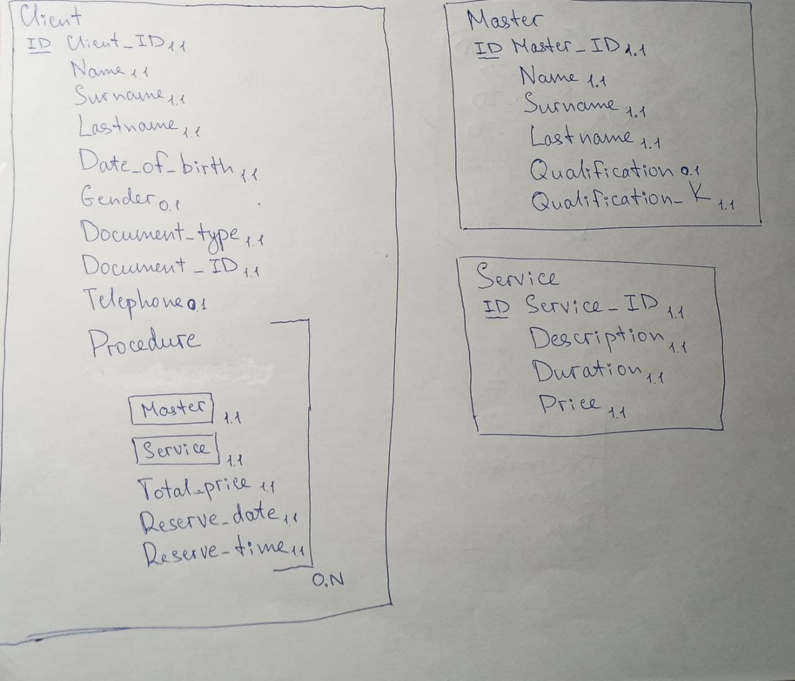

## Лабораторная работа №2
### Задания
1. Cоздать модель семантических объектов для предметной области, выбранной в лабораторной работе №1;
2. Обосновать выбор кардинальных чисел атрибутов и типов объектов.

### Схема
