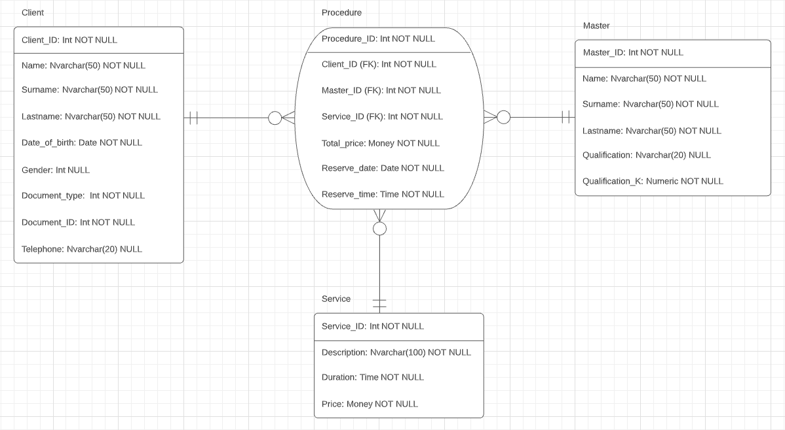

## Лабораторная работа №3
### Задания
1. Преобразовать модель «сущность-связь», созданную в лабораторной работе №1, в реляционную модель согласно процедуре преобразования;
2. Обосновать выбор типов данных, ключей, правил обеспечения ограничений минимальной кардинальности.

### Схема

