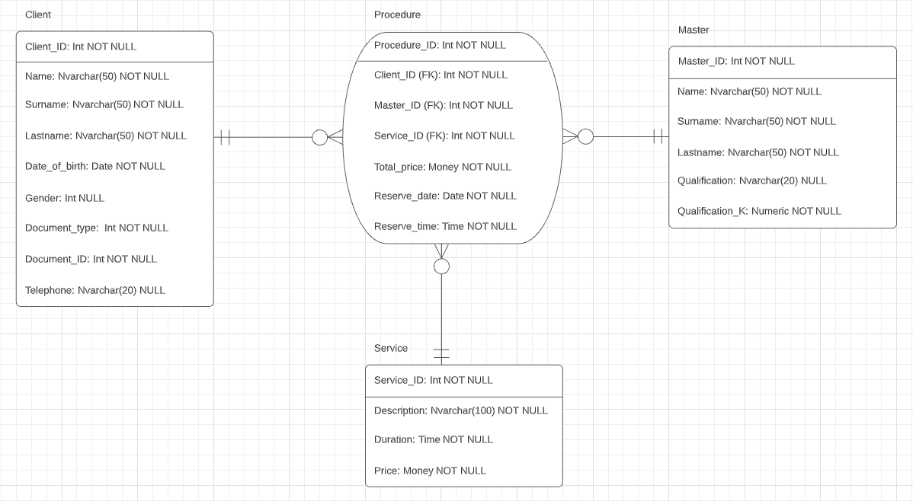

## Лабораторная работа №4
### Задания
1. Преобразовать модель семантических объектов, созданную в лабораторной работе №2, в реляционную модель согласно процедуре преобразования;
2. Сопоставить результаты проектирования с использованием модели «сущность-связь» и модели семантических объектов (лабораторные работы №3, №4);
3. Обосновать различия результатов, выявить и исправить ошибки проектирования.

### Схема

