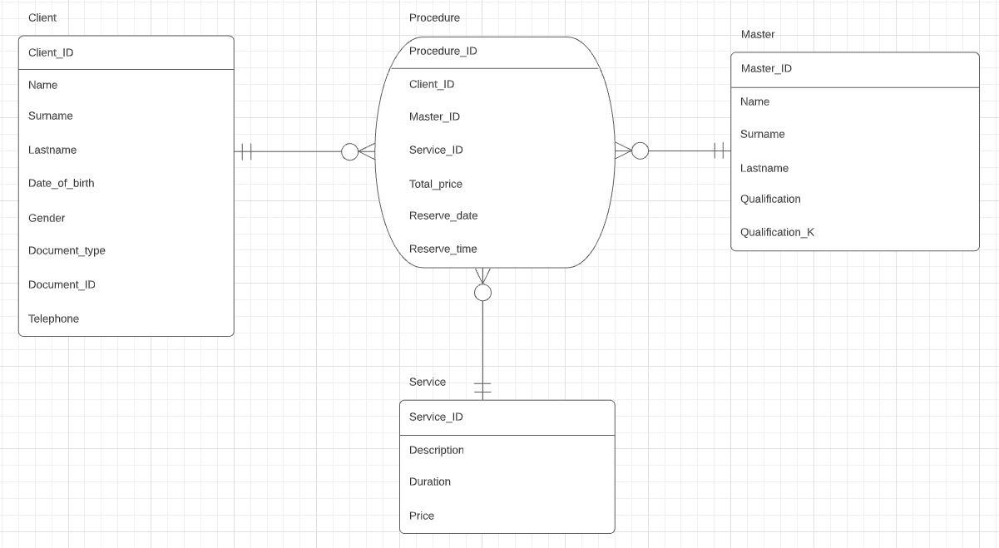

## Лабораторная работа №1
### Задания
1. Выбрать простейшую предметную область, соответствующую 4-5 сущностям;
2. Сформировать требования к предметной области;
3. Создать модель «сущность-связь» для предметной области с обоснованием выбора кардинальных чисел связей.

### Схема

